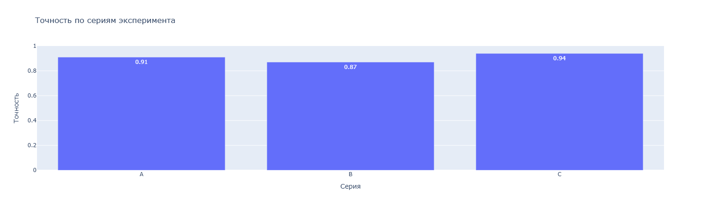

# Эксперимент

Эта страница проверяет отображение изображения, сносок и формул.

## Изображение

Если вместо графика отображается пустое место или значок битой картинки,
проверь наличие файла `docs/img/plot.png`.

## Сноска

Это предложение содержит сноску[^1].

[^1]: Тестовая сноска MkDocs Material.

## Простая формула

$$
E = mc^2
$$

## Формула align

$$
\begin{align}
\mathrm{Accuracy} &= \frac{TP}{TP + FN}, \\
\mathrm{Error} &= 1 - \mathrm{Accuracy}
\end{align}
$$

## Тест русского поиска

эксперимент, эксперимента, эксперименты, экспериментальный,
измерение, измерений.
